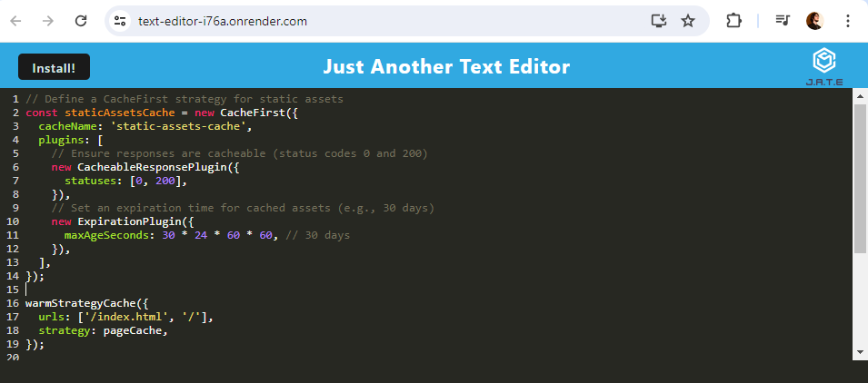
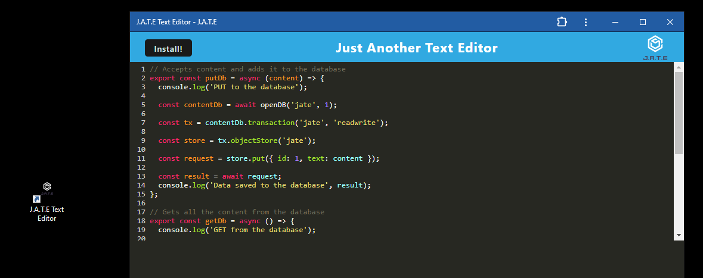

# text-editor-pwa

## Description

Text editor progressive web application featuring a number of persistent data techniques.

- This application utilizes both local storage and IndexedDB from the browser to store a users text content.  
- It includes a service worker that assists in deploying a few strategies for caching assets.
- As a progressive web application, you can install the app and have an icon on your dashboard.  The application can be used completely offline.
- The Workbox package builds the client side files for distrubition and Babel aids in converting ES6 JavaScript language to "vanilla" JavaScript, so async and await functions won't cause compatabilty issues with some browsers.

## Table of Contents

- [Deployment](#deployment)
- [Usage](#usage)
- [Credits](#credits)
- [License](#license)
- [Questions](#questions)

## Deployment

Here is the [Deployed Application](https://text-editor-i76a.onrender.com/) hosted by [Render](https://render.com/) cloud infrastructure.

*NOTE: The free tier of Render's web services incorporates spinning down on idle.  See below for how this impacts this application.*

Render Documentation

[Spinning Down on Idle](https://docs.render.com/free#spinning-down-on-idle) - "Your free instance will spin down with inactivity, which can delay requests by 50 seconds or more."

"Render spins down a Free web service that goes 15 minutes without receiving inbound traffic. Render spins the service back up whenever it next receives a request to process."

"Spinning up a service takes a few seconds, which causes a noticeable delay for incoming requests until the service is back up and running. For example, a browser page load will hang momentarily."

WHAT THIS MEANS: The application will likely take a minute to load the first time you navigate it.  Requests times will be faster after that.  And THANKFULLY, this is a progressive web application.  Install the application and you will be able to use it offline.  More details on that in the next section. 

## Usage

Here is the [Code Repository](https://github.com/briandwach/text-editor-pwa).

- You may begin adding text content once the application loads.  Your text content is saved to local storage upon every change.  When the text editor loses window focus, the content is saved to IndexedDB.  Each time the editor is loaded it will restore the data in IndexedDB if it is there, otherwise it will retrieve what is in local storage.    

  

- The application assets are stored in cache so the app can be used completely offline.  NOTE: Text content is only persistent to the specific browser you use it in.

- Click the install button and then follow prompts for installation including confirming that you would like an icon on your desktop.  This will give you a shortcut to the application and you can use the application in standalone mode.  It will operate as if you are using a native app.  

  

## Credits
The starting source code for this project was provided by the Northwestern Coding Bootcamp's [NU-VIRT-FSF-PT-12-2023-U-LOLC GitLab Repository](https://git.bootcampcontent.com/Northwestern-University/NU-VIRT-FSF-PT-12-2023-U-LOLC/-/tree/main/19-PWA/02-Challenge/Develop?ref_type=heads)

## License
This application is covered under the [MIT License](http://choosealicense.com/licenses/mit/).

## Questions
Please email me with any questions regarding this application at: brian.d.wach@gmail.com

Additionally, checkout more of my work on GitHub: [briandwach](https://github.com/briandwach)
